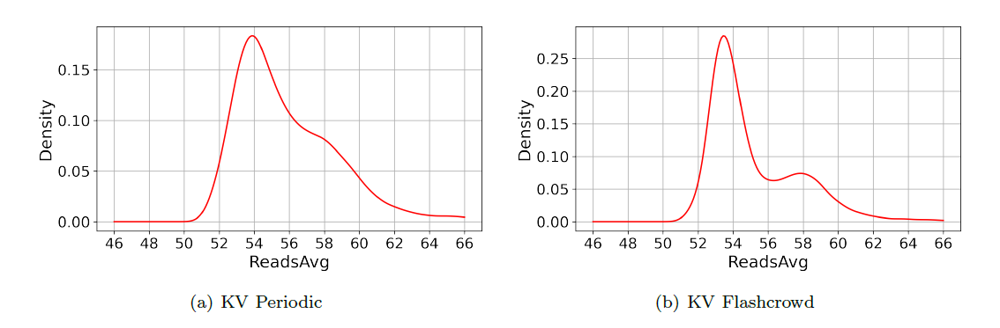
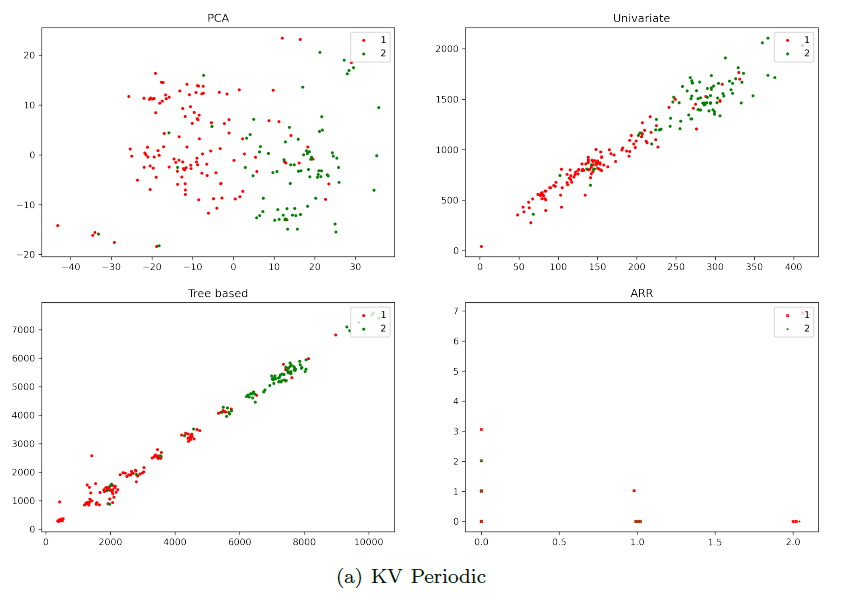
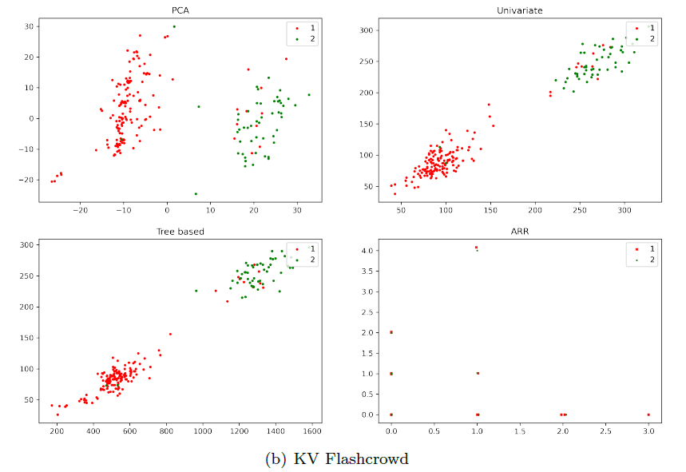
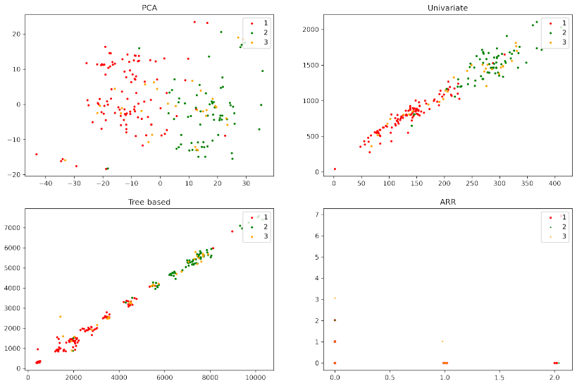

## Info

This is the project for the course EP2420 Network Analytics at KTH. The full report can be found in the [report](https://github.com/yangBryants/AML-assignment1-programming-task/blob/main/report.pdf).

In this project, we (me together with Jie Huang) investigate and compare different methods to reduce the dimensionality of the feature space of networked system data.  

We not only reduce the complexity of the model by combining dimensionality reduction and training with data over a short period but also use the dimensionality reduction results to visualize the state of the system. 

Tools: Python, related packages: Numpy, SciPy, Matplotlib, Scikit-learn, and Pandas.

## Interesting results

In Task 3, we want to find the mapping of the samples of a trace into a two-dimensional space, so that the data visually separates to the target values. We use a special method to separate the data:

we can use the boundary between the 2 peaks (around 56) as the classification threshold. But in the right figure, the boundary point is not that obvious.

It can be used to explain why the following results for the KV Flashcrowd are better than KV Periodic.

We can verify this explanation. We mark the points with 'ReadsAvg' between 55 and 57 in orange, and the result is shown below. We can see that the orange points are mixed between the red and green points. If the orange points are removed, then the classification result will be much better, which verifies our theory.

